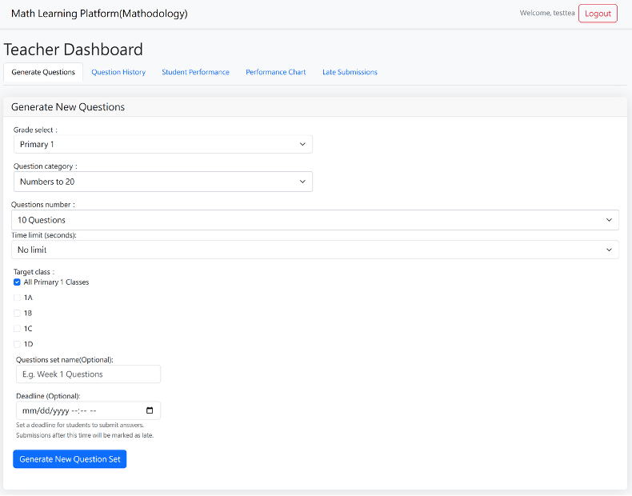
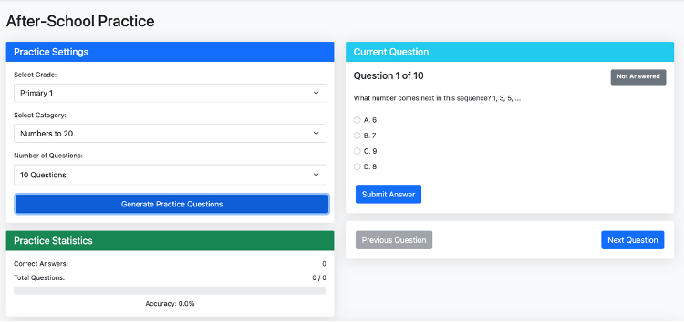
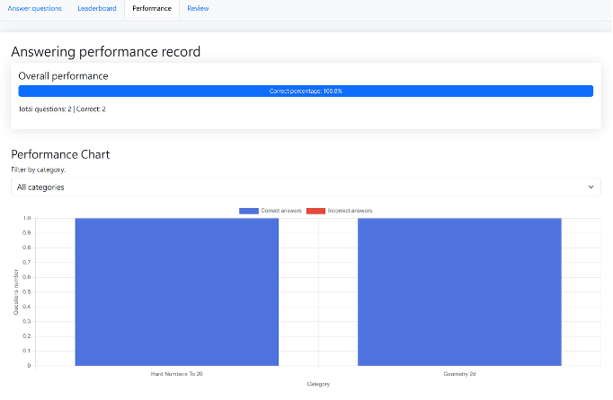
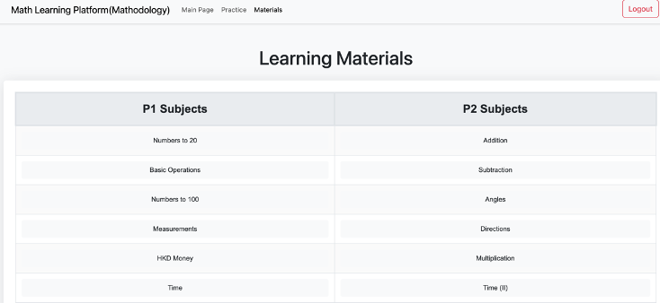
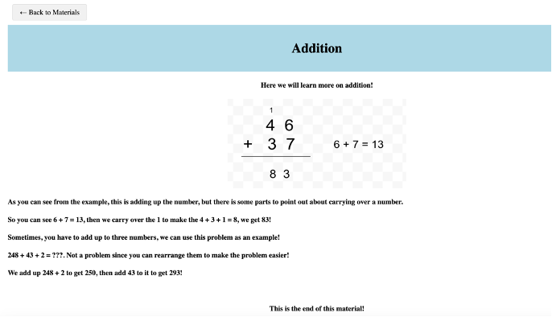

# Mathodology — Primary School Math E-Learning Platform

A web platform for **Primary 1–2 mathematics** that lets teachers generate and assign
question sets in a few clicks, and gives students instant feedback, progress tracking
and self-paced practice. Built for the Hong Kong primary maths curriculum.

> **Team project (2 members).** My contribution and the parts I did not build are
> stated explicitly in [My Contribution](#my-contribution). All code in my own scope
> was written with heavy AI assistance — see [How this was built](#how-this-was-built).

---

## Screenshots

| Teacher — generate a question set | Student — after-school practice |
|---|---|
|  |  |

| Student — performance record and chart | Learning materials index |
|---|---|
|  |  |

| A learning-material lesson page |
|---|
|  |

> Screenshots are from the original project demo. Every account shown is a
> **fictional demo account** created for testing; no real user data was used.

---

## What it does

Teachers pick a grade and a maths topic, and the **server generates the questions with
randomised numbers on the spot** — no pre-written question bank. The set is assigned to
one or more classes with an optional time limit, a name and a deadline. Students answer
the sets assigned to their class, get marked immediately, and can review mistakes or
practise more. Teachers get per-class and per-student analytics and an Excel export.

There are **37 question categories** across the two grades (harder variants included),
covering number sense, the four operations, measurement, Hong Kong money, time and
clocks, 2D/3D shapes, positions, the calendar, pictograms and angles.

---

## Features

### Student
- **Answer assigned question sets** — see only the sets targeted at your class or grade.
- **Instant marking** — each answer is graded on submission and the correct answer is shown.
- **Personal performance report** — accuracy, totals, and a per-category breakdown.
- **Performance chart** — correct vs. incorrect answers by topic (Chart.js).
- **Weakness detection** — strongest category and "needs improvement" category.
- **Review completed sets** — revisit a finished set and see every answer you gave.
- **Practise your wrong answers** — re-drill only the questions you got wrong.
- **Leaderboards** — class ranking and grade ranking by correct answers.
- **After-school practice** — generate your own practice set by grade, topic and count; accuracy is tracked live in the sidebar.
- **Learning materials** — per-topic lesson pages for self-study.
- **Per-question timer** — optional countdown that auto-submits when it runs out.

### Teacher
- **Generate question sets** — grade, category, number of questions, optional time limit, target classes, set name and deadline.
- **Target specific classes** — assign to individual classes, to all of Primary 1, all of Primary 2, or everyone.
- **Question history** — browse, filter, rename, reassign to other classes, or delete past sets.
- **Review any set** — inspect the generated questions before/after assigning.
- **Student performance report** — filter by grade and class, view per-student accuracy.
- **Performance chart** — plot a class or a single student by category.
- **Export results to Excel** — download the result report as an `.xlsx` file.
- **Late submissions** — list students who submitted after the deadline, by grade and class.
- **Delete individual answer records** — remove a single stored answer.

### Admin
- **User management** — search and filter all accounts, edit username/password/role/grade/class, clear a user's records.
- **Question management** — browse the question database by category, delete a question, or clear all questions.
- **System statistics** — total users, teacher and student counts, class distribution, most active students, total questions, questions by category, overall correct-answer rate, and per-class category performance.

---

## Tech stack

**Frontend**
- Plain HTML5, CSS3 and vanilla JavaScript (ES6) — no framework, no bundler, no build step
- Bootstrap 5 (5.1.3 / 5.2.3 / 5.3.0 are all used in different pages)
- Chart.js — performance charts
- ExcelJS (browser build) — client-side `.xlsx` export
- Font Awesome — icons
- All of the above are loaded from a **CDN**, not bundled locally

**Backend**
- Node.js
- Express 4 — routing and static file serving
- bcryptjs — password hashing
- body-parser — JSON body parsing
- Pages are served as static files with `res.sendFile()`; there is **no template engine**

**Database**
- MongoDB Atlas (hosted) with Mongoose 6
- Two collections: `users` and `questions`
- Each student's answers are stored as an **embedded array** (`user.scores[]`) rather than a separate collection

> `exceljs` is listed in `package.json` but the app never calls `require('exceljs')` —
> the Excel export runs in the browser instead. It is an unused dependency.

---

## Getting started

### Requirements
- **Node.js** — the original code uses CommonJS and Mongoose 6, so Node.js 16–20 is the safe range. `TODO: confirm the exact Node version used during development.`
- **npm** (comes with Node.js)
- A **MongoDB** database. The code connects with a MongoDB Atlas connection string, so either an Atlas cluster or a local MongoDB instance works.

### Setup

```bash
# 1. Clone
git clone https://github.com/CLF551/FYP-MATHODOLOGY.git
cd FYP-MATHODOLOGY

# 2. Install dependencies
npm install

# 3. Point the server at a database
#    app.js currently reads the connection string from MONGODB_URI.
#    Create a file named .env in the project root containing:
#        MONGODB_URI=mongodb+srv://<user>:<password>@<cluster>/<database>
#    (or a local one: mongodb://127.0.0.1:27017/mathodology)

# 4. Start the server
npm start
```

> **Note:** the connection string in the committed source is a placeholder, not a working
> URI, so the server will not connect until you supply your own `MONGODB_URI`.

Then open **http://localhost:3000**.

The server listens on port **3000** (hardcoded in `app.js`).

### Demo accounts

`TODO: confirm` — the accounts that existed during development were fictional demo
accounts on a database that has since been deleted. The database **no longer exists and
the old credentials are not usable**.

If you want to run the demo again you must create your own accounts:
- Register a **student** through `/register` (pick a grade and class).
- Register a **teacher** through `/register`.
- An `admin` user is created automatically on first boot if it does not exist.

> The auto-created admin uses a **hardcoded default password**, and the database URI was
> originally hardcoded in `app.js`. Both must be moved to environment variables before
> this project is run anywhere other than a local throwaway database. See
> [Known limitations](#known-limitations).

---

## My Contribution

This was a **two-person final-year project**. I am not claiming the whole system.

### What I built
- **Backend (all of it)** — `app.js`: the Express server, both Mongoose schemas, and all
  ~38 API endpoints (authentication, question-set CRUD, assignment, submission, scoring,
  leaderboards, late-submission detection, admin APIs, statistics).
- **The question-generation engine** — the 33 `generate*` functions plus the dispatcher,
  covering **37 question categories** for Primary 1 and Primary 2, each producing
  randomised questions with a computed answer and (for multiple choice) shuffled options.
  This was the largest single piece of work in the project.
- **Teacher interface** — `views/teacher.html` + `public/js/teacher.js`: question
  generation and assignment, question history, student performance reports, performance
  charts, Excel export, late-submission view.
- **Student interface** — `views/student.html` + `public/js/student.js`: answering assigned
  sets, performance report and chart, review of completed sets, wrong-answer practice,
  both leaderboards.
- **Admin interface** — `views/admin.html` + `public/js/admin.js`: user management,
  question management, system statistics.
- **Practice page** — `views/practice.html` + `public/js/practice.js`.
- **Authentication flow** — `public/js/auth.js` (login, registration, logout).
- **Database design** — the `users` and `questions` schema shapes.
- **Integration of the learning materials** — I wired my teammate's lesson pages into the
  platform (the `/materials` index and the `/materials/:topic` route).
- **Shared report work** — the final report was written jointly with my teammate.

### What I did NOT build
- **The learning material lesson pages** — every file in `HTML Files/`, plus the images
  under `public/images/materials/`. These were produced by my teammate, who was
  responsible for the learning-materials content. I only linked them into the app.
- I do not know how my teammate produced those pages (they may or may not have used AI
  assistance); I can only speak for my own code.

### Honest note on AI assistance
**All of the code I was responsible for was written with AI assistance.** I directed the
work, broke the system into features, specified behaviour, tested it, debugged it,
integrated the pieces and adjusted it — but I did not hand-write the code.

I am stating this plainly rather than letting it be inferred from the code.

---

## How this was built

- **AI-assisted development throughout** — see the note above.
- **Two-person team** — see [My Contribution](#my-contribution) for the split.
- **Almost no commit history.** The project was developed as a folder and pushed to GitHub
  in a few large commits at the end, so the history does not document how the work
  progressed.

---

## Project structure

```
.
├── app.js                 # Entire backend: Express server, Mongoose schemas,
│                          # ~38 API routes, and all 33 question generators
├── package.json           # Dependencies and the "npm start" script
├── models/
│   └── User.js            # An earlier User schema — NOT required by app.js and
│                          # no longer matches the live schema (dead code)
├── views/                 # Server-rendered page shells, returned by res.sendFile()
│   ├── index.html         # Landing page
│   ├── login.html / register.html
│   ├── student.html       # Student dashboard (answer / leaderboard / performance / review)
│   ├── teacher.html       # Teacher dashboard (generate / history / performance / chart / late)
│   ├── admin.html         # Admin panel (users / questions / statistics)
│   ├── practice.html      # After-school practice
│   └── materials.html     # Learning-materials index
├── public/                # Static assets, served from /
│   ├── css/styles.css     # The single stylesheet used by every page
│   ├── js/
│   │   ├── auth.js        # Login / register / logout
│   │   ├── student.js     # Student dashboard logic
│   │   ├── teacher.js     # Teacher dashboard logic
│   │   ├── admin.js       # Admin panel logic
│   │   └── practice.js    # Practice page logic
│   ├── shapes/            # 2D/3D shape images used in generated questions
│   ├── hardshapes/        # Shape images for the harder variants
│   ├── clock/             # Pre-rendered clock faces (clock_H_MM.png)
│   ├── coins/             # Hong Kong coin images
│   ├── banknotes/         # Hong Kong banknote images
│   ├── angles/            # Angle images
│   └── images/materials/  # Images for the learning-material lesson pages
└── HTML Files/            # The 23 lesson pages, served at /materials/<topic>
```

---

## Known limitations

Five things worth knowing about. I have listed them honestly rather than presenting the
project as more finished than it is.

1. **There is no server-side authentication or authorization.** Login only returns a role to
   the browser; the app then stores the username and role in `localStorage`, and every API
   endpoint trusts the `username` supplied by the client. There are no sessions, tokens or
   cookies and no authorization middleware on any route, so role checks exist only in the
   front end and the `/admin/*` endpoints can be called without logging in. Self-registration
   also accepts any role, so a teacher account can be created by anyone.
2. **Question data is not authoritative on the server.** `GET /get-questions-by-set/:setId`,
   `GET /get-questions` and `POST /api/practice-questions` all include the correct answer in
   the response, so answers can be read from the network before submitting. The practice page
   additionally grades in the browser and never calls `/submit-answer`, so practice attempts
   are never persisted.
3. **Answer generation is not fully reliable.** Distractors are drawn from small pools, so
   some multiple-choice questions contain a duplicate option (measured at roughly 12%–68% of
   questions depending on the category). The intended answer is still graded correctly, but
   it can look ambiguous. One category — P2 time calculation — has a real defect: around
   **4%** of its questions store an answer letter that does not match the intended time.
   `hard_positions` and `p2_data` are also broken categories that silently return **zero
   questions** instead of an error.
4. **There are no automated tests.** `package.json` has a single `start` script, and there is
   no test suite, linter, lockfile or `.gitignore`. The question generators are the
   highest-risk part of the codebase and have no test coverage at all. The unit, integration
   and partial security tests described in the project report were all performed by hand.
5. **The system has never been used by real users.** It has only ever run against a small
   local/demo database, so there are **no usage figures or measured performance numbers**,
   and none are claimed here. The user-evaluation survey designed in the project report was
   never carried out.

Anything else — duplicate code, dead files, an unused dependency, the size of `app.js` — is
worth knowing but is not listed here; the five above are the ones that affect behaviour.

---

## Future work

Roughly in order of value:

1. **Add real authentication** — server-side sessions or JWT, plus authorization middleware
   on every route, so roles are enforced on the server instead of in the browser.
2. **Stop sending answers to the client** — strip `answer` from question payloads, grade only
   on the server, and persist practice results so they count towards reports.
   Move secrets out of source into environment variables.
3. **Write an automated test suite for the question generators** — verify that every category
   produces the expected number of questions with a correct, non-ambiguous answer. This is
   the cheapest way to catch the defects described above.
4. **Split `app.js`** (3906 lines) into routes, models and per-grade generator modules, and
   split `teacher.js` (3017 lines) by feature.
5. **General hardening** — a linter, a lockfile, `.gitignore`, an Express error-handling
   strategy, pinned dependency versions, and a clear failure path for unknown categories.
   Read the database connection string, the port and the initial admin password from
   environment variables instead of from source.

---

## Acknowledgements

This project was completed as a **final-year project** by a two-person team.

Thanks to our **project supervisor** for guidance throughout, and to our **course
instructors** for their teaching and feedback. Thanks also to my teammate, who produced the
learning-material content and lesson pages, and to the classmates and family who supported
us during the project.

---

## License

This project is released under the MIT License.

The Hong Kong coin and banknote images under `public/coins/` and `public/banknotes/` are
reproductions of currency used for educational illustration; the third-party images in
`public/images/materials/` and `public/hardshapes/` may be subject to their own terms.
